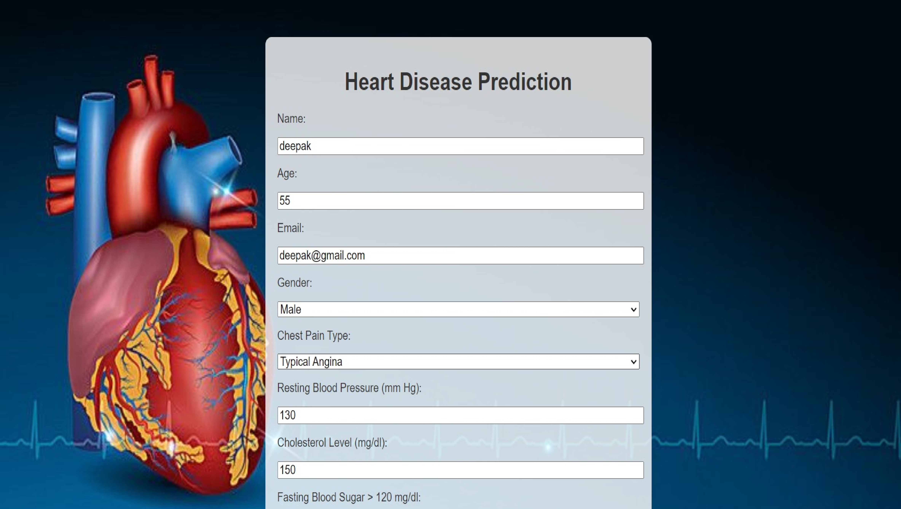
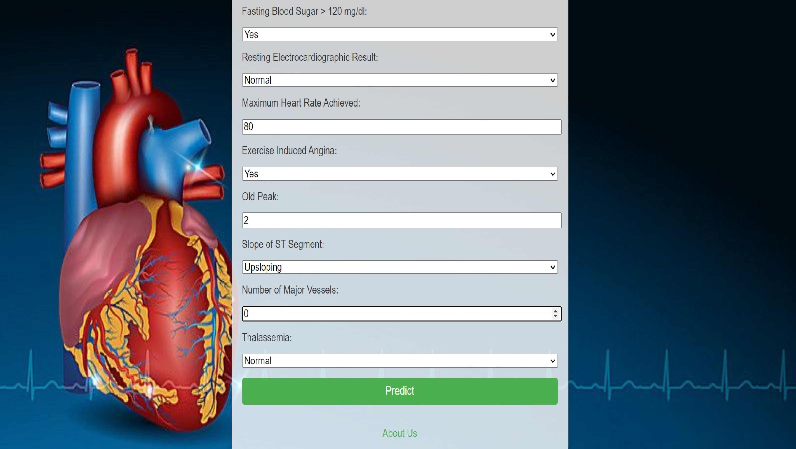

# Heart Disease Prediction App

## Description

This Flask-based web application predicts the likelihood of heart disease based on user input. It uses multiple machine learning models to provide predictions and evaluates each model’s performance. The app includes a user-friendly interface for input and displays the prediction results along with model-specific details.

## Screenshots

### Index Page


*Size: 800x600 pixels*

*Size: 800x600 pixels*

### Result Page


*Size: 800x600 pixels*

*Size: 800x600 pixels*

## Models Used

The application utilizes the following machine learning models:

1. **Random Forest**: An ensemble learning method that combines multiple decision trees to improve prediction accuracy and control overfitting.
2. **Logistic Regression**: A statistical model that estimates the probability of a binary outcome based on one or more predictor variables.
3. **Decision Tree**: A model that uses a tree-like graph of decisions and their possible consequences, including chance event outcomes.
4. **SVC (Support Vector Classifier)**: A classification method that finds the hyperplane that best divides a dataset into classes.
5. **K-Nearest Neighbors (KNN)**: A classification algorithm that assigns the class of the majority of its nearest neighbors.

## Instructions

### Setting Up the Environment

1. **Create a Virtual Environment**

   Use `conda` to create a virtual environment. Replace `myenv` with your desired environment name.

   ```bash
   conda create --name myenv python=3.8
